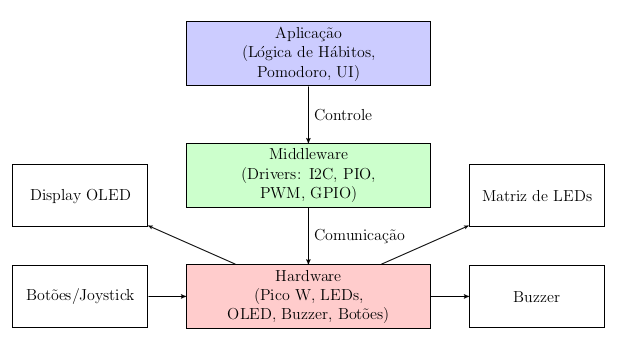

# Habit Tracker - Raspberry Pi Pico W

# Visão Geral

## Descrição

Este projeto é um sistema embarcado para rastreamento de hábitos, desenvolvido no Raspberry Pi Pico W. Ele visa auxiliar pessoas que trabalham ou estudam na frente do computador, monitorando tempo de foco, pausas e outros aspectos relacionados à saúde e produtividade.

## Objetivo

O objetivo é proporcionar uma solução que permita o rastreamento de hábitos essenciais de forma independente de dispositivos móveis, facilitando a adoção de comportamentos mais saudáveis e produtivos. A proposta visa estimular o uso contı́nuo do sistema, utilizando feedbacks visuais e sonoros que incentivem o usuário a manter o foco nas suas rotinas diárias, criando uma experiência envolvente e motivadora. Além
disso, busca-se garantir que o sistema contribua para um aumento real na produtividade, proporcionando uma maneira prática e eficiente de gerenciar o tempo e as atividades.

## Aplicativo

Para facilitar o monitoramento e proporcionar uma visão completa dos hábitos, foi desenvolvido um aplicativo minimalista para isso. Nele, o usuário pode acompanhar todas as informações sobre seus hábitos ao longo do dia de forma prática e organizada.

## Hardware - Software Embarcado

O software embarcado envia lembretes visuais e auditivos para que o usuário beba água, se exercite e se alimente, utilizando efeitos sonoros e iluminação em LED para indicar a ação a ser realizada. Paralelamente, o sistema monitora a frequência dessas atividades, atualizando as contagens em tempo real e exibindo-as em uma matriz de LEDs e em um display OLED, o que proporciona um acompanhamento visual intuitivo. Além disso, inclui um temporizador Pomodoro que o usuário pode ativar para gerenciar ciclos de trabalho.

## Arquitura de Comunicação

A arquitetura do projeto é dividida em três partes principais: Hardware, Backend e Aplicativo (Frontend). O hardware, responsável pelo sistema de rastreamento de hábitos, envia dados via requisições HTTP. O backend segue a divisão em Controller, Service e Model, gerenciando as requisições, salvando e acessando o banco de dados. Por fim, o aplicativo, também organizado em camadas de dados e interface, exibe as informações ao usuário de forma prática.

## Arquitura do Software Embarcado e Pinagem

A arquitetura do embarcado está organizado:

- **Aplicação:**
  - Gerencia a lógica principal do sistema, incluindo contadores de hábitos (água, exercício, alimentação).
  - Implementa a técnica Pomodoro para gerenciamento de tempo.
  - Controla a interface do usuário (UI) exibida no display OLED.
  - Processa entradas do usuário (botões e joystick) para navegação no menu e confirmação de ações.

- **Middleware:**
  - Fornece drivers para comunicação com dispositivos de hardware:
    - **I2C:** Comunicação com o display OLED.
    - **PIO:** Controle da matriz de LEDs WS2818B.
    - **PWM:** Geração de tons no buzzer.
    - **GPIO:** Leitura de botões e joystick.
  - Traduz comandos da aplicação em sinais de hardware.

- **Hardware:**
  - **Raspberry Pi Pico W:** Microcontrolador principal que executa o software.
  - **Botões/Joystick:** Entrada do usuário para interação com o sistema.
  - **Buzzer:** Emite alertas sonoros para notificações.
  - **Display OLED:** Exibe o menu e informações sobre hábitos e Pomodoro.
  - **Matriz de LEDs:** Fornece feedback visual sobre o status dos hábitos.

### Pinagem

- Botão A [1]: GPIO 5, pull-up.
- Botão B [2]: GPIO 6, pull-up.
- Joystick [3]: Entrada analógica (ADC) GP26.
- LEDs RGB [4]: GPIO 11 (Verde), GPIO 12 (Azul), GPIO 13 (Vermelho).
- Buzzer [5]: GPIO 21, Controlado via PWM.
- Matriz de Leds [6]: GPIO 7
- Display Oled [7]: I2C, GPIO SDA 14, GPIO SCL 15

## BitDogLab

Projeto construído na BitDogLab.